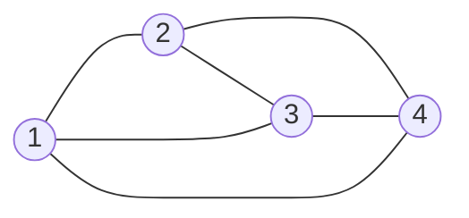
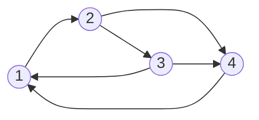
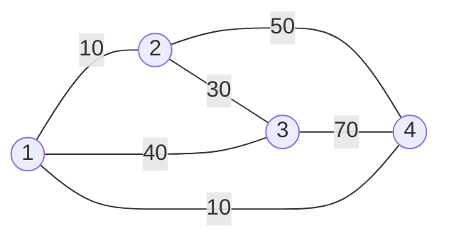
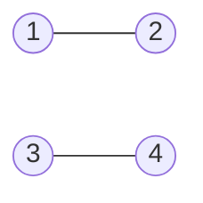
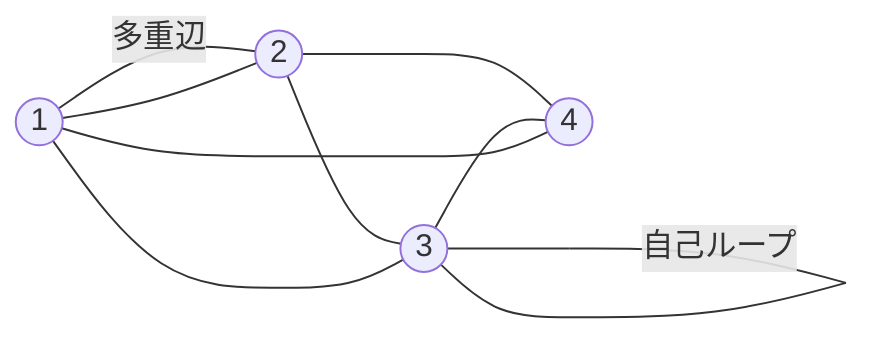
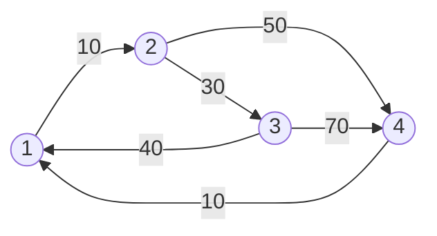

# グラフ問題

**グラフ**は，**ノード**(頂点)と，それらを繋ぐ**エッジ**(辺)からなる．このドキュメントでは，特に断りのない限りグラフのノード集合を\\(V\\)，辺集合を\\(E\\)とする．ノード数は\\(|V|\\)，辺数は\\(|E|\\)で表される．

## グラフでよく出る単語
### パス(道)
あるノードから始めて，いくつかの辺をたどって，あるノードにたどり着くまでのノードの列を**パス**(道)という．有向グラフの場合，向きに従ってたどる必要がある．

また，同じノードを2回通らないパスを**単純パス**といい，同じ辺を2回通らないパスを**路**(トレイル)という

### 閉路
あるノードから始めて，同じノードに戻ってくるパス(始点と終点が同じ路)を**閉路**という．

### 次数
あるノードについて，直接繋がっている辺の数を**次数**という．また，有向グラフでは，入ってくる辺の辺の数を**入次数**，出ていく辺の数を**出次数**という．

## グラフの種類
### 無向/有向グラフ
上の図のグラフは辺に向きがなく，**無向グラフ**と呼ばれる．一方で下の図ように辺に向きがあるグラフは**有向グラフ**という．

### 重み付きグラフ
下の図のように辺に重みがあるグラフを**重み付きグラフ**という．一般的にノード間の距離や移動コストを表すことが多い．

### 連結/非連結グラフ
グラフ上の任意の2ノード間がいくつかの辺をたどって到達可能である(任意の2ノード間にパスが存在する)ものを**連結グラフ**，そうでない下のようなグラフを**非連結グラフ**という．

### 単純/多重グラフ
今まで上で出てきたグラフは全て**単純グラフ**である．下のグラフのように，自己ループや多重辺を含むグラフは**多重グラフ**という．

### DAG
閉路を持たない有向グラフを**DAG(有向非巡回グラフ)**という．

## プログラムでのグラフの持ち方
プログラム上でのグラフの持ち方は主に2つある．例えば，このような単純連結重み付きグラフの情報を持つ場合，下の2つのような持ち方がある．

- 隣接行列: 任意の2頂点の辺の取得が\\(O(1)\\)でできるが，空間計算量が\\(O(|V|^2)\\)．

|i/j|1|2|3|4|
|:-:|:-:|:-:|:-:|:-:|
|**1**|-|10|-|-|
|**2**|-|-|30|50|
|**3**|40|-|-|70|
|**4**|10|-|-|-|

- 隣接リスト: 空間計算量が\\(O(|V|+|E|)\\)．

|ノード|接続された辺のリスト|
|:-:|:-|
|**1**|[{to: 2, cost: 10}]|
|**2**|[{to: 3, cost: 30}, {to: 4, cost: 50}]|
|**3**|[{to: 1, cost: 40}, {to: 4, cost: 70}]|
|**4**|[{to: 1, cost: 10}]|