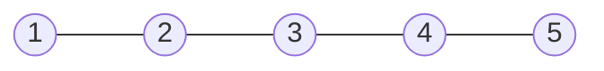
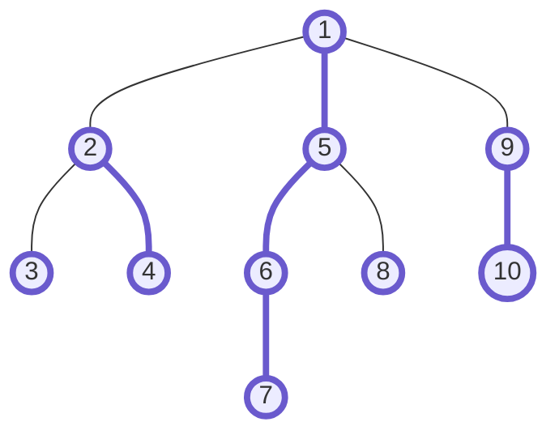
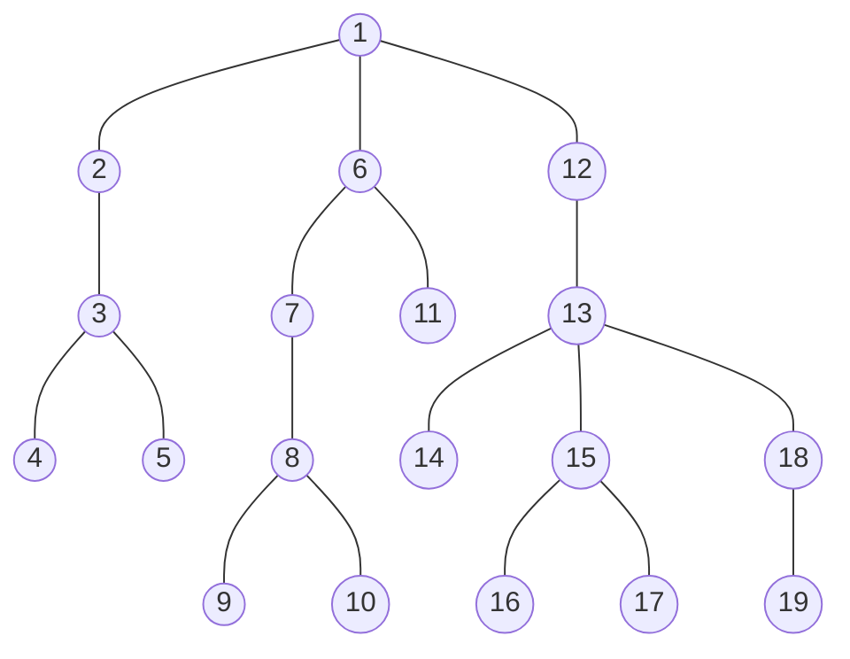
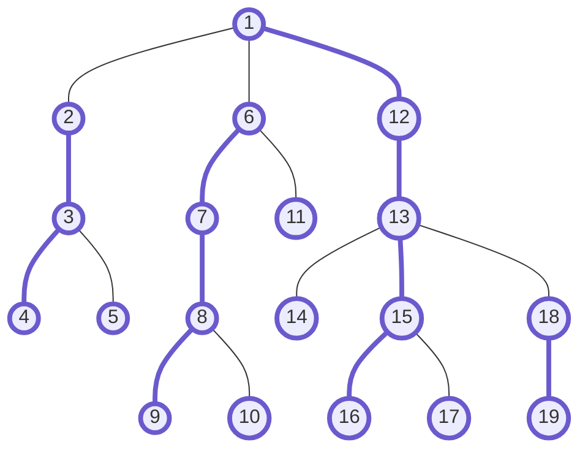

# HL分解
HL分解の各操作と時間計算量は以下．
- 構築: \\(O(|V|)\\)
- 木のLCA: \\(O(\log |V|)\\)
- 木の任意のノードの値(モノイド)の更新: \\(O(\log |V|)\\)
- 木の任意2ノード間のパスクエリ: \\(O(\log ^2|V|)\\)

※パスクエリというのは，あるパスについて，与えられた2項演算(以降便宜上仮に"和"と呼ぶ)で，通った順番にノード上の値を累積していって得られる値を求めるクエリのこと．

## 説明
はじめに，以下のように**枝分かれのない極端な木**を考える．



木に枝分かれがない場合(全てのノードの次数が2以下の木の場合)，これは単純に**ノードの一次元配列**と見なすことができる．よって，このような木であれば，**値の更新**，および任意のパスにおける**パスクエリ**に高速に答えるためには**セグメント木**を用いればよいことがわかる．



では任意の木においてこれらのクエリに答えるためには，**木をいくつかのパスに分解**し，分割した各パスにおいては累積"和"を求めるためにセグメント木を利用し，それらを合わせればいいのではないか．これがHL分解の基本的なアイディアである．

例えば上のように木をいくつかのパスに分解すると，1->7パスや6->1パスのように，パス上の全てのノードが同じセグ木上で連続した並びになっているパスは1回のセグ木に対する操作でパスクエリが求まり，6->10パスのようなパスでは6->1と9->10で合わせて2回セグ木で操作を行い，それらを合わせればよいということである．

しかし，異なるセグ木を操作した回数を\\(N\\)とすると，パスクエリに対する計算量は当然\\(O(N \log |V|)\\)となるため，各セグ木の操作が高速でも，**この\\(N\\)が大きくなるとパスクエリに高速に答えることができない**．

ここからは，この\\(O(N)\\)を小さくするためのアイディアについて説明する．

結論からいうと，**各親から見て，部分木のノード数が最も多い子への辺を選択する**．(個数が同じ子が複数ある場合はどれを選んでも良い．)選択した辺を**heavy辺**といい，選択しなかった辺を**light辺**という．(HL分解はHeavy-Light分解を意味している．)

つまり，任意のパスにおいて，連続したheavy辺(以下**heavyパス**と呼ぶ)の個数が先ほどの\\(N\\)となる．任意のパス上でheavyパスの個数が最大いくつになるかを考えると少し難しいので，**まずはパスの終点を木の根と仮定して考える**．



まずはheavy辺とlight辺に塗り分ける．



この木を例にしながら，**任意の点から根までのパスにいくつのheavyパスが含まれるか**を考える．ノード1個単体で，どこにもheavy辺が伸びていないものも1つのheavyパスとみなすと，任意のパスにおいて，heavyパスと1本のlight辺を交互に通ることになる．そのため，パス上のheavyパスの個数とパス上のlight辺の個数の差は必ず\\(1\\)以下になる．つまり，**パス上のheavyパスの個数を抑えることは，パス上のlight辺の個数を抑えることと言い換えることができる**．

仮に，始点をノード19，終点を根としよう．まず，19->18の累積"和"を対応するセグ木を使って求める．次の18->13を見ると，これはlight辺である．**ここにlight辺があるということはつまり，ノード18を根とする部分木のサイズ(ノード数)は，最大でも，ノード13を根とする部分木のサイズの半分以下**ということである．もし半分以上のサイズならここはheavy辺になっているはずだからだ．実際に，ノード13を根とする部分木のサイズは7，ノード18を根とする部分木のサイズは2であり，半分以下である．これはつまり，**light辺を通るたびに，全体の推定ノード数が，その下の部分木のサイズの2倍(以上)になる**ということである．したがって，全体のノード数を\\(|V|\\)とすると，任意のノードから根までのパスに，**light辺は最大でも\\(O(\log |V|)\\)個しか含まれない**ことがわかる．従って，heavyパスの個数のオーダも\\(O(\log |V|)\\)であり，また，それぞれのheavyパスにおいて，セグ木の操作により\\(O(\log |V|)\\)がかかるため，任意のノードから根までのパスクエリの計算量は\\(O(\log ^2 |V|)\\)である．

最後に，任意の2ノード間\\(u\\)->\\(v\\)のパスクエリを求める計算量は，\\(u\\)->\\(root\\) \\(+\\) \\(root\\)->\\(v\\)のパスクエリの計算量より小さいことに注目すると，後者の計算量は\\(O(2 \log ^2 |V|) = O(\log ^2 |V|)\\)であるため，**前者の計算量も\\(O(\log ^2 |V|)\\)で抑えられる**ことがわかる．

LCAを求めるクエリについても，上と同様にlight辺の個数は\\(O(\log |V|)\\)であるため，**高々\\(O(\log |V|)\\)回上るとLCAにたどりつける**ことがわかる．

## 実装
先ほどの木を例として考える．

### パスクエリ
まずはパスクエリから．


17->19のパスクエリを求めてみる．
1. ノード17を左ノード，ノード19を右ノードとする．
2. ノード17が含まれるheavyパスで最も根に近いノード(以降topノードと呼ぶ)と，ノード19のtopノードの深さを比較する．ノード17とノード18では，ノード17の方が深いため，ノード17の値を左側から累積した後，左ノードをノード15に移動する．
3. ノード15のtopノードと，ノード19のtopノードの深さを比較すると，今度はノード1よりもノード18の方が深いため，19->18を右側から累積した後，右ノードをノード13に移動する．
4. ノード15のtopノードとノード13のtopノードが等しいことから，これらは同じheavyパス上にあることがわかる．よって，単に左ノード->右ノードで値を累積し，左側の累積値に累積する．
5. 最後に左側の累積値と右側の累積値の"和"を取った値が求める値である．

このようにしてパスクエリを求めることができる．ここで，パスクエリを求める疑似コードを示す．

```rs
fn query(lnode, rnode) -> S {
  let prodl: S = e() // 左側の累積値を単位元で初期化
  let prodr: S = e() // 右側の累積値を単位元で初期化
  while true {
    let topl = lnode.top
    let topr = rnode.top
    if lnode.top == rnode.top { // 左ノードと右ノードが同じheavyパスにある場合
      if lnode.depth > rnode.depth
        prodl = op(prodl, prod(lnode, rnode)) // 左ノード->右ノードパスの累積値を左側に累積
      else
        prodr = op(prod(rnode, lnode), prodr) // 右ノード->左ノードパスの累積値を右側に累積
      return op(prodl, prodr) // 左側の累積値と右側の累積値の"和"を返す
    }
    // topノードの深さの深い方を上にあげる
    if lnode.top.depth > rnode.top.depth { // 左ノードのtopノードの方が深さが深い場合
      prodl = op(prodl, prod(lnode, lnode.top)) // 左ノード->topパスの累積値を左側に累積
      lnode = lnode.top.parent // lnodeを上にあげる
    } else { // 右ノードのtopノードの方が深さが深い場合
      prodr = op(prod(rnode.top, rnode), prodr)  // top->右ノードパスの累積値を右側に累積
      rnode = rnode.top.parent // rnodeを上にあげる
    }
  }
}
```

### 構築
上の疑似コードから，パスクエリを求めるにはそれぞれのノードのtopノード，深さ，親，heavyパス上での位置などの情報が必要となることがわかる．これらを，最初に構築フェースで求める．これらは，**木を2回DFSすることで全て求めることができる**．

まず，それぞれのノードの木上での深さ，親は，1回DFSをすることで求められる．また，その際に，下の部分木のサイズを足しながら親に戻っていくことで，各親はheavy辺を決定することができる．2回目のDFSでは，**heavy辺を優先したDFSを行う**ことでtopノードを求めることができる．また，その際，**通ったノードを順に並べていく**ことで，各heavyパス上での位置も求めることができる．

2回目のDFSの説明が分かりづらいと思うので，先ほどの木を例に説明する．


この木で**heavy辺を優先したDFSを行い，通ったノードを順に並べる**とこのようになる．

|1|12|13|15|16|17|14|18|19|2|3|4|5|6|7|8|9|10|11|

すると，heavy辺を優先して探索したため，**全てのheavyパスが，この配列の連続する部分列として現れている**ことがわかる．
これを**1本**のセグ木に持ち，各ノードのインデックスを持っておくことで，**1本のセグ木だけで任意のheavyパスの累積値を求めることができる**．

この構築フェーズは，木上でDFSを2回行うだけなので，計算量は\\(O(|V|)\\)である．

### 実装におけるその他の注意事項
実装上注意すべきことをいくつか最後に述べる．

まず1つ目は，パスクエリでは，**向きを間違えてはいけない**ということ．\\(u\\)->\\(v\\)の累積値を求めるなら，最左を\\(u\\)，最右を\\(v\\)として，累積値を取るときに右側からとるのか左側から取るのかを間違えてはいけない．

2つ目は，先ほどセグ木は1本と言ったが**実際には2本必要**であるということ．任意のheavyパスは，パスによっては右からも左からも累積値を取る可能性がある．よって，**2方向分で2本セグ木が必要**である．パスクエリの実装の際に，どっちのセグ木を使うかを間違えないように注意する．

以上！

## コード
[](https://judge.yosupo.jp/submission/68674)
```cpp
class Node {
public:
  int depth, parent, top, idxf, idxb;
  Node() : parent(-1) {}
};

template <class S, S (*op)(S, S), S (*e)()> class HLD {
public:
  HLD() : HLD(vector<vector<int>>(0), -1) {}
  explicit HLD(vector<vector<int>> &tree, int root_)
    : HLD(tree, root_, vector<S>(int(tree.size()), e())) {}
  explicit HLD(vector<vector<int>> &tree, int root_, const vector<S> &v)
    : n(int(tree.size())), root(root_) {
    build_(tree, v);
  }
  void build(vector<vector<int>> &tree, int root_) {
    n = int(tree.size());
    build(tree, root_, vector<S>(n, e()));
  }
  void build(vector<vector<int>> &tree, int root_, const vector<S> &v) {
    n = int(tree.size());
    root = root_;
    build_(tree, v);
  }
  // set element to node
  void set(int node, S x) {
    stf.set(nodes[node].idxf, x);
    stb.set(nodes[node].idxb, x);
  }
  // lca
  int lca(int ln, int rn) {
    while (1) {
      int topl = nodes[ln].top, topr = nodes[rn].top;
      if (topl == topr) {
        if (nodes[ln].depth < nodes[rn].depth) return ln;
        else return rn;
      }
      if (nodes[topl].depth > nodes[topr].depth) ln = nodes[topl].parent;
      else rn = nodes[topr].parent;
    }
  }
  // path query
  S query(int ln, int rn) {
    S prodl = e(), prodr = e();
    while (1) {
      int topl = nodes[ln].top, topr = nodes[rn].top;
      if (topl == topr) {
        if (nodes[ln].depth < nodes[rn].depth) { // rn is deeper than ln
          prodl = op(prodl, stf.prod(nodes[ln].idxf, nodes[rn].idxf+1));
        } else { // ln is deeper than rn
          prodl = op(prodl, stb.prod(nodes[ln].idxb, nodes[rn].idxb+1));
        }
        return op(prodl, prodr);
      }
      if (nodes[topl].depth > nodes[topr].depth) {
        prodl = op(prodl, stb.prod(nodes[ln].idxb, nodes[topl].idxb+1));
        ln = nodes[topl].parent;
      } else {
        prodr = op(stf.prod(nodes[topr].idxf, nodes[rn].idxf+1), prodr);
        rn = nodes[topr].parent;
      }
    }
  }
private:
  int n, root;
  segtree<S, op, e> stf, stb;
  vector<Node> nodes;
  void build_(vector<vector<int>> &tree, const vector<S> &v) {
    assert(n == int(v.size())); assert(root < n);
    // create segtree
    stf = segtree<S, op, e>(n);
    stb = segtree<S, op, e>(n);

    nodes = vector<Node>(n);
    vector<int> heavy(n, -1);
    pp1(tree, heavy, root, root, 0);
    pp2(tree, v, heavy, 0, root, root, root);
  }
  // set heavy node, parent, depth
  int pp1(vector<vector<int>> &tree, vector<int> &heavy, int node, int p, int d) {
    nodes[node].parent = p;
    nodes[node].depth = d;
    int sz = 1, sz_max = 0, sz_c;
    for (int &c: tree[node]) {
      if (c == p) continue;
      sz_c = pp1(tree, heavy, c, node, d+1); // get child's size
      sz += sz_c; // update size
      if (chmax(sz_max, sz_c)) heavy[node] = c; // update heavy node
    }
    return sz;
  }
  // build segtree, set top
  int pp2(vector<vector<int>> &tree, const vector<S> &v, vector<int> &heavy, int tour_idx, int node, int p, int t) {
    nodes[node].idxf = tour_idx;
    stf.set(tour_idx++, v[node]);
    nodes[node].idxb = n - tour_idx;
    stb.set(n - tour_idx, v[node]);
    nodes[node].top = t; // set top
    if (heavy[node] >= 0) { // heavy node and depth first search
      tour_idx = pp2(tree, v, heavy, tour_idx, heavy[node], node, t);
    }
    for (int &c: tree[node]) {
      if (c == p || c == heavy[node]) continue;
      tour_idx = pp2(tree, v, heavy, tour_idx, c, node, c); // next node is top
    }
    return tour_idx;
  }
};
```