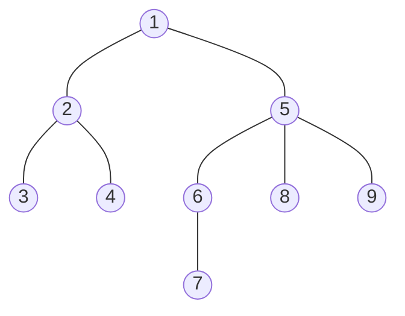

# 木

グラフのうち，連結でかつ閉路がないグラフを**木**という．
また，その特徴から，次の条件を満たすものは木であると言える．

- 連結で閉路がない
- 閉路がなく\\(|E| = |V| - 1\\)
- 連結で\\(|E| = |V| - 1\\)
- 連結で全ての辺が橋
- 閉路がなく，辺を1つ加えると必ず閉路ができる
- 任意の2ノード間のパスが1本

## 木でよく出る単語
### 根
木では，任意のノードを**根**と定めることができる．根が定められた木を**根付き木**という．

### 深さ
根と定めたノードからの距離を**深さ**という．(ここでいう距離では，辺の重みは考慮しない．)
根付き木において，任意のノードについて，自分と接続された，自分より深さが1低いノードをそのノードの**親**という．根は親を持たず，根以外のノードは必ず親を**1つだけ**もつ．また，自分と接続された親以外の全てのノードのことを**子**という．さらに，あるノードから子をたどってたどり着けるノードはそのノードの**子孫**といい，あるノード\\(u\\)があるノード\\(v\\)の**子孫**であるとき，\\(v\\)は\\(u\\)の**下**にあるという．また，\\(u\\)を\\(v\\)の**祖先**であるという．

### 部分木
木において，ある1辺を取り除くと，必ず2つの木となる．木から，ある1辺を取り除いて得られる木を全てその木の**部分木**という．根付き木においてあるノードとその下の部分を取り出した部分とも言える．

また，あるノードからその親

### LCA
ある2つのノードが与えられたとき，その2つのノードを自分の下に持つノードを，**共通祖先**といい共通祖先のうち，最も深さが深い(大きい)ものをその2つのノードの**LCA(最小共通祖先)**という．

### n分木
根付き木において，全てのノードが\\(n\\)個以下の子を持つとき，それを**n分木**という．また，全てのノードがちょうど\\(n\\)個の子を持つとき，それを**完全n分木**という．
