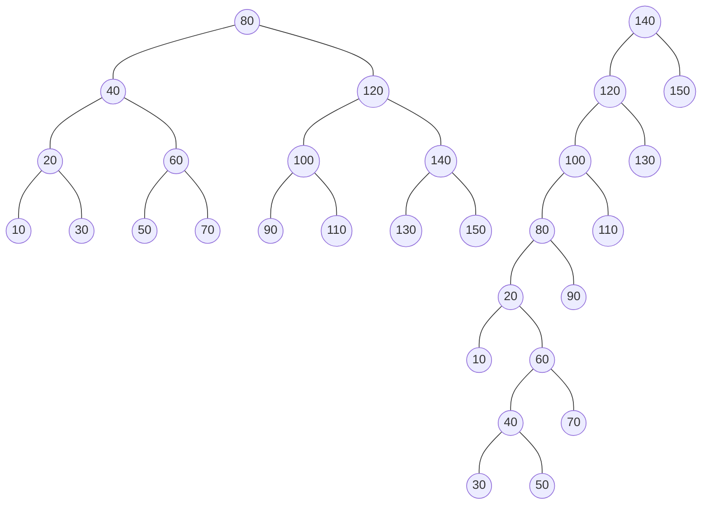
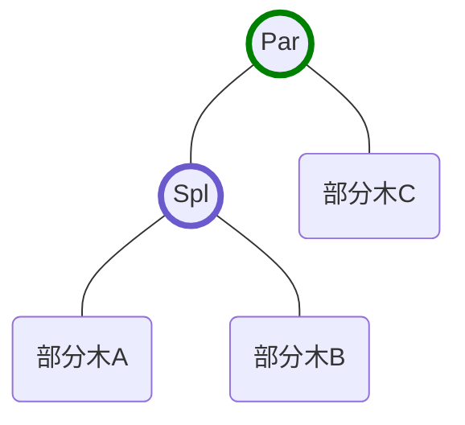
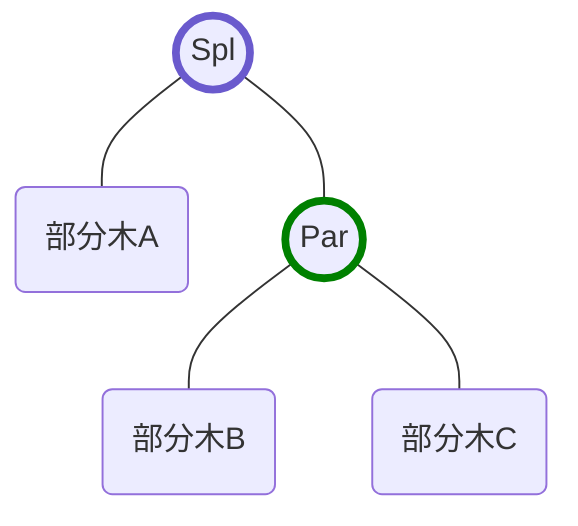
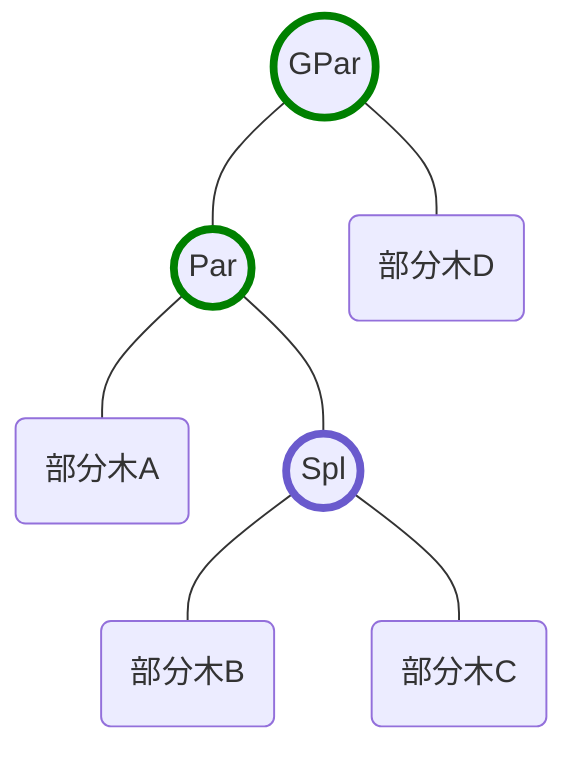
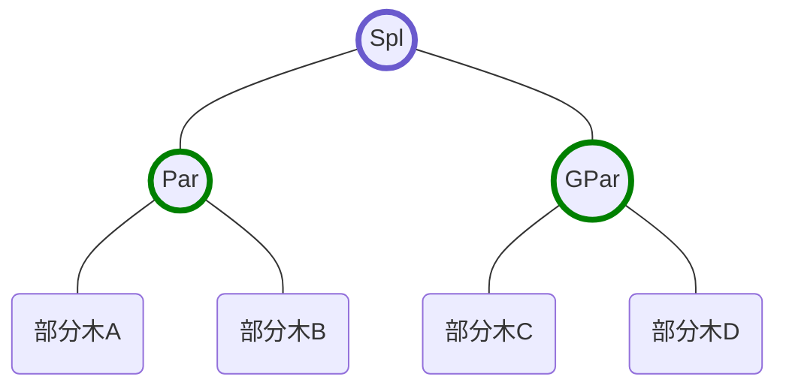
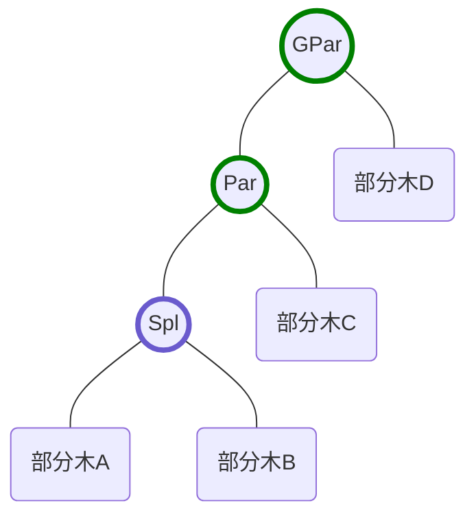
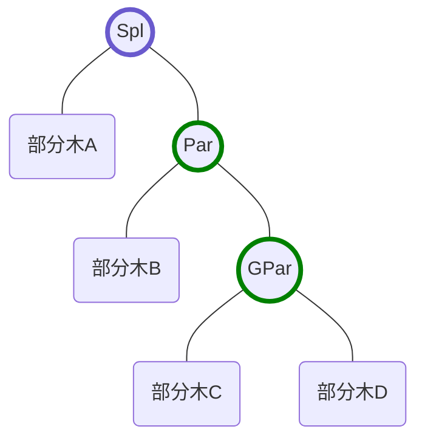

# splay木
splay木は平衡2分探索木の1つである．splay木の各操作と時間計算量は以下．
- 値(大小関係が定義されている必要がある)の挿入: 償却計算量\\(O(\log N)\\)
- 値の削除: 償却計算量\\(O(\log N)\\)
- 値の検索/取得: 償却計算量\\(O(\log N)\\)

償却計算量についてはこの章の後半で説明する．

## 平衡2分探索木
まず，splay木固有の話ではなく，**平衡2分探索木**の基本的な説明をする．

平衡2分探索木は，追加された値を各ノードとした**2分木**を形成する．また，形成された根付き木の，任意のノードについて以下の条件が成り立つようにする．

- 左の子を根とする部分木に含まれる値は全て親より小さい
- 右の子を根とする部分木に含まれる値は全ては親より大きい

平衡2分探索木で，扱う**値に大小関係が定義されている必要がある**理由は，このように大小関係に基づいて内部の木を形成するからである．では，例えば，値10, 20, 30, 40, 50, 60, 70, 80, 90, 100, 110, 120, 130, 140, 150が追加された場合，平衡2分探索木はどのようになるだろうか．

実は，**形成される木は複数あり得る**．例えば，左下のように**偏りがない**綺麗な2分木になることもあれば，右下のような木もちゃんと条件を満たしている．



ページが大きくなるので描かないが，もちろん，最も小さい値から，昇順に右の子に次の値が来るような1本道の木も条件を満たしている．では，このように大小関係に基づいて木を形成すると何が嬉しいかというと，値を検索する際，根ノードから始めて，**今見ているノードより探索しているノードが大きいか小さいかで左の子と右の子に降りるかを選択**して降りるというのを続けるだけで必ず目的のノードにたどり着くことができるということである．

では，ここで木の形について触れる．**偏った木**と，**偏りがない木**と，どちらが嬉しいだろうか．偏りがあるということは，その分，深さが深いノードが存在するということ．探索するノードの深さが深いほど，探索する時間は増えてしまう．よって，偏りがない木ほどより嬉しい．そのため，平衡2分探索木には，形成する2分木をなるべく**平衡**に保つという機能があるのである．より平衡になると，木の高さが，扱っているデータ数を\\(N\\)として\\(O(\log N)\\)になるため，各種操作の計算量が全て\\(O(\log N)\\)になるというわけだ．

ここでもう1つ触れておきたいのは，平衡2分探索木における`lower_bound`，および`upper_bound`という操作について．`lower_bound`は，指定した値**以上**の最小の値を探索するというもので，`upper_bound`は，指定した値**より大きい**最小の値を探索するというもの．これらの操作の実装は，2分探索木で共通していて，AVL木であってもsplay木であってもその他であっても基本的には同じである．それぞれ，下のようなコードで目的のノードを探索することができる．

```cpp
Node* bound(T k, bool lower) {
  Node *left = root, *right = nullptr;
  while (left) {
    if ((lower && !(k > left->k)) || (!lower && (k < left->k))) {
      right = left;
      left = left->l;
    } else left = left->r;
  }
  return right;
}
```

// TODO : このコードの説明を追記予定

**値の挿入でも検索でも削除でも，内部で`lower_bound`を実行することで目的のノードを探索する**ため，これは平衡2分探索木の**最も基本的かつ重要な操作**と言える．`lower_bound`の計算量は，<br>\\(O(\\)探索しているノードが存在する深さ\\()\\)である．平衡2分探索木の全ての操作の計算量は`lower_bound`の計算量になると考えてよい．

## splay木
splay木では，値の検索，削除など全ての操作の中で**splay**という特殊な操作を行う．上で，平衡2分探索木の各操作は内部で全て`lower_bound`を行うと述べた．**splay操作は，`lower_bound`の計算量を\\(O(\log N)\\)に保証するための操作**であると考えるとわかりやすい．**splay木では，全ての操作の計算量はsplay操作の計算量となる**．

上で，`lower/upper_bound`については既に説明したので，検索，削除等の細かい実装については説明しない(このページの1番下に載せたコードを参照して欲しい)．というわけで，ここからは，**splay**操作について説明する．

## splay操作
splay操作は，簡単に言うと，**あるノードを根にする**という操作である．splay木では，アクセスしたノードをsplayして根に持っていくということをする．何のためにするかというと，`lower_bound`の計算量を抑えるためである．まずは，splayをするとなぜ計算量が抑えられるのかということは説明せずに，単にsplay操作とは何かを説明する．

splay操作は，**zig**，**zig-zag**，**zig-zig**の3つの操作によってノードを根まで持っていく操作である．

### zig
zigは，**splayしたいノードの親が根ノードである時**に行われる操作である．



上のような木を下のように変形する．変形した後も，平衡2分探索木の大小関係の条件をちゃんと満たしている．



この例は，splayしたいノードが根ノードの左の子である場合のzigだが，右の子である場合も左右対称の同様の操作になる．

### zig-zag

zig-zagは，**splayしたいノードと親ノードの関係が，親ノードと親の親ノードの関係と逆の時**に行われる操作である．**これは実質，splayしたいノードに対してzigを2回行うことと同じである**．なのになぜzigと区別してここに示しているかは，後半の計算量解析の時に分かるので今は考えなくてよい．



上のような木を下のように変形する．



この例は，splayしたいノードは右の子であり親ノードは左の子であるが，逆の，splayしたいノードが左の子で，親ノードが右の子である場合も左右対称の同様の操作になる．

### zig-zig

zig-zigは，**splayしたいノードと親ノードの関係が，親ノードと親の親ノードの関係と同じ時**に行われる操作である．**これは実質，親ノードに対してzigを1回行った後にsplayしたいノードにzigを1回行うことと同じである**．



上のような木を下のように変形する．



この例は，splayしたいノードは左の子であり親ノードも左の子であるが，逆の，splayしたいノードが右の子で，親ノードも右の子である場合も左右対称の同様の操作になる．

splay操作は，splayしたいノードとその親ノード，親の親ノードとの関係から，zig，zig-zag，zig-zigの内適切なものを選んで木を変形(一般に木の**回転**と呼ばれる)することを繰り返して，そのノードを根まで持っていく操作である．

## splay操作の計算量と各操作の計算量との関係
話の流れを切らさないために結論から述べると，splay操作の**償却計算量**は\\(O(\log N)\\)である．償却計算量についてはこの後に説明するが，簡単に言うと，**一連の操作を行なった時，その1回あたりの計算量の平均を取ると\\(O(\log N)\\)になるということが保証される**ということである．もっと噛み砕いて言うと，バランスの取れていない木で深さの深いノードをsplayすると，それはその操作単体で見ると時間がかかっているかもしれない．しかし，**連続して**何回もsplay操作を行なった時，**全体の計算量が，splay操作回数を\\(k\\)として\\(O(k \log N)\\)になることを保証できる**ということ．これが償却計算量の意味である．splay操作の償却計算量がなぜ\\(O(\log N)\\)になるかはひとまず置いといて，もしそうなるとしたら何が嬉しいのかを考えよう．

冒頭で，**splay操作は，`lower_bound`の計算量を\\(O(\log N)\\)に保証するための操作**であると述べた．`lower_bound`の計算量は，<br>\\(O(\\)探索しているノードが存在する深さ\\()\\)<br>であった．ではsplay操作はどうだろうか．zig1回の操作でそのノードが1つ上に上がり，zig-zagやzig-zigのようにzigを2回行う操作でそのノードが2つ上がるため，**splay操作の計算量は<br>\\(O(\\)splayしたいノードが存在する深さ\\()\\)**<br>である．splayするノードと，探索したノードが等しければ，これらは当然同じである．つまり，**`lower_bound`でアクセスしたノードをsplayする**ことで，**`lower_bound`の計算量をsplay操作の計算量で保証することができるのである**．

## splay操作の償却計算量の導出
<u>※この章はかなり読むのがしんどいと思います．コードだけ欲しい人は，飛ばして最後までスクロールしてください．</u>

償却計算量とは，上でも述べたように，**続けて行なった一連の操作**の，平均した1回あたりの計算量である．混同しやすいものとして，**平均計算量**があるが，これは別物である．平均計算量は，**操作を独立したものとして考える**．あらゆる入力に対してその操作を**1回**行なった時の計算量の平均が平均計算量である．大きな違いは，平均計算量の場合，最悪の入力がされ続けた場合，1回あたりの操作の計算量の平均がその計算量に収まるかがわからないが，償却計算量の場合はその計算量に収まることを保証できるということ．

償却計算量の導出には，**ポテンシャル解析**という手法が用いられる．ポテンシャル解析では，操作が行われる前と後の状態を**ポテンシャル関数**というもので評価する．ポテンシャル関数で評価した値は**借金**みたいなものと考えるとわかりやすい．**後の操作の計算量を悪化させる**ような操作を行った場合は，**その操作自体は速かったとしても**その分を考慮して評価すべきである．これがポテンシャル解析の基本的な考え方である．

ポテンシャル\\(\Phi\\)が満たす必要のある条件は以下．

- 任意の\\(i\\)について，\\(i\\)番目の操作を行なった後の状態\\(\Phi_i\\)について，\\(\Phi_i \geq 0\\)
- \\(\Phi_0 = 0\\)

これらの条件を満たすポテンシャル\\(\Phi\\)を定義したとする．このとき，行なったある操作の実計算量を\\(T\\)とすると，この操作の償却計算量\\(\tilde{T}\\)との間に以下の式が成り立つ．

$$\tilde{T} = T + \Delta\Phi$$

よって，例えば操作を\\(k\\)回行ったとすると，全操作の合計計算量について，以下の式が成り立つ．

$$\sum\_{i=1}^k \tilde{T}\_i = \sum\_{i=1}^k T\_i + \sum\_{i=1}^k \Delta \Phi\_i$$

ここで重要なことは，上の条件より，**\\(\Delta\Phi \geq 0\\)であるため，\\(\sum\_{i=1}^k \tilde{T}\_i\\)を上から抑えることができれば，実計算量\\(\sum\_{i=1}^k T\_i\\)も同様の計算量で抑えることができる**ということである．

上で述べた2つの条件を満たすポテンシャル関数はいくらでも定義できる．しかし，このポテンシャル関数を適切なものにしなければ，\\(\Delta\Phi\\)が大きくなってしまい，解析の意味がなくなってしまう．splay操作の償却解析において用いるポテンシャル関数\\(\Phi\\)を，以下のように定義する(と上手くいく)．

\\(s(x)\\) = ノード\\(x\\)を根とする部分木のサイズ(部分木に含まれるノード数)<br>\\(r(x) = \log_2 s(x)\\)<br>\\(\Phi(x) = \sum r(x)\\)

木に存在する全ノードの\\(r(x)\\)の合計をポテンシャルとして定義するのは，直感的にも理にかなっている．なぜなら，深さの深いノードが多くある状態(**後の操作の計算量が悪くなりそうな状態**)では，そのノードを下(部分木)に持つノード数が多いため，**\\(\Phi(x) = \sum r(x)\\)の値が増加する**．

ここから，実際にsplay操作の償却計算量\\(\tilde{T}\_{splay}\\)を導いていく．

\\(\tilde{T}\_{splay}\\)を導くために，まず，\\(\tilde{T}\_{zig}\\)，\\(\tilde{T}\_{zig-zag}\\)，\\(\tilde{T}\_{zig-zig}\\)を導く．なぜなら，splay操作は，**複数回のzig-zagもしくはzig-zig操作**と，**最後の1回のzig操作**から成っているからだ．

### zigの償却計算量
zigをもう1度振り返ると，以下のような操作である．


上のような木を下のように変形する．


この操作の償却計算量は以下で表せる．

$$\tilde{T}\_{zig} = T\_{zig} + \Delta\Phi = T\_{zig} + (\sum\_x r\_{new}(x) - \sum\_x r\_{pre}(x))$$

zigは1回の操作であるため，\\(T\_{zig} = 1\\)である．あとは，\\(\sum\_x r\_{new}(x) - \sum\_x r\_{pre}(x)\\)の部分を求めたい．先ほどの木の変形に注目すると，zigによって\\(r(x)\\)の値が変化したのは，実はsplayしたいノード(以下\\(s\\)ノードと呼ぶ)とその親ノード(以下\\(p\\)ノードと呼ぶ)だけである．よって，式は以下のように変形できる．

$$\tilde{T}\_{zig} = 1 + \lbrace(r\_{new}(s) + r\_{new}(p)) - (r\_{pre}(s) + r\_{pre}(p))\rbrace$$

ここで，上の木の変形の図から，\\(r\_{new}(p) - r\_{pre}(p)\\)は負であることが分かる．よって，以下の式が成り立つ．

$$\tilde{T}\_{zig} \leq 1 + r\_{new}(s) - r\_{pre}(s) \leq 1 + 3r\_{new}(s) - 3r\_{pre}(s)$$

なぜ一部係数を\\(3\\)にしたかは後で分かるので，今はこの式が成り立つことさえ確認できればok．

### zig-zagの償却計算量
zig-zagをもう1度振り返ると，以下のような操作である．


上のような木を下のように変形する．


zigの時と同様に木の変形に注目すると，\\(r(x)\\)の値が変化したのは\\(s\\)ノードと\\(p\\)ノードとその親のノード(以下\\(g\\)ノードと呼ぶ)だけである．よって，以下の式が成り立つ．

$$\tilde{T}\_{zig-zag} = T\_{zig-zag} + \Delta\Phi = 2 + r\_{new}(s) - r\_{pre}(s) + r\_{new}(p) - r\_{pre}(p) + r\_{new}(g) - r\_{pre}(g)$$

ここで，上の木の変形の図から，\\(r\_{pre}(g) = r\_{new}(s)\\)であること，\\(r\_{pre}(p)>r\_{pre}(s)\\)であることから，下のように変形できる．
$$\tilde{T}\_{zig-zag} \leq 2 - 2r\_{pre}(s) + r\_{new}(p) + r\_{new}(g)$$

ここで，\\(r(x)\\)は\\(\log s(x)\\)であることを思い出すと，式は以下のように変形される．

$$\tilde{T}\_{zig-zag} \leq \log \frac{s\_{new}(p) \times s\_{new}(g)}{s\_{new}(s) \times s\_{new}(s)} + 2 + 2r\_{new}(s) - 2r\_{pre}(s)$$

ここで，以下の式\\((\*)\\)を示す．

$$\log \frac{s\_{new}(p) \times s\_{new}(g)}{s\_{new}(s) \times s\_{new}(s)} \leq -2 \qquad (\*)$$

この式を変形して，

$$\frac{s\_{new}(p)}{s\_{new}(s)} \times \frac{s\_{new}(g)}{s\_{new}(s)} \leq \frac{1}{4}$$

が得られる．ここで，zig-zagで木を変形した後の図から，

$$\frac{s\_{new}(p)}{s\_{new}(s)} + \frac{s\_{new}(g)}{s\_{new}(s)} \leq 1$$

であることが分かる．和の最大値が定められている時，積の最大値はそれら2つの値が等しく，和の最大値\\(/2\\)である時である(この証明は簡単なので省略する)．よって，

$$\frac{s\_{new}(p)}{s\_{new}(s)} \times \frac{s\_{new}(g)}{s\_{new}(s)} \leq \frac{1}{2} \times \frac{1}{2} = \frac{1}{4}$$

が証明され，式\\((\*)\\)が示された．ここで，元の式に戻ると，式\\((\*)\\)を使って，以下のように変形できることが分かる．

$$\tilde{T}\_{zig-zag} \leq \log \frac{s\_{new}(p) \times s\_{new}(g)}{s\_{new}(s) \times s\_{new}(s)} + 2 + 2r\_{new}(s) - 2r\_{pre}(s) \leq 2r\_{new}(s) - 2r\_{pre}(s)$$

従って，以下の式が示された．

$$\tilde{T}\_{zig-zag} \leq 3r\_{new}(s) - 3r\_{pre}(s)$$

こちらも，なぜ一部の係数を\\(3\\)にしたかは後で分かるので，この式が成り立つことさえ確認できればok．

### zig-zigの償却計算量
zig-zigをもう1度振り返ると，以下のような操作である．


上のような木を下のように変形する．


こちらも同様に木の変形に注目すると，\\(r(x)\\)の値が変化したのは\\(s\\)ノードと\\(p\\)ノードと\\(g\\)ノードだけである．よって，以下の式が成り立つ．

$$\tilde{T}\_{zig-zig} = 2 + r\_{new}(s) - r\_{pre}(s) + r\_{new}(p) - r\_{pre}(p) + r\_{new}(g) - r\_{pre}(g)$$

ここで，上の木の図から，\\(r\_{pre}(p) < r\_{pre}(s)\\)であること，\\(r\_{new}(p) > r\_{new}(s)\\)であること，\\(r\_{pre}(g) = r\_{new}(s)\\)であることから，以下のように変形できる．

$$\tilde{T}\_{zig-zig} \leq 2 - 2r\_{pre}(s) + r\_{new}(s) + r\_{new}(g)$$

ここで，\\(r(x)\\)は\\(\log s(x)\\)であることを思い出すと，式は以下のように変形される．

$$\tilde{T}\_{zig-zig} \leq \log \frac{s\_{pre}(s) \times s\_{new}(g)}{s\_{new}(s) \times s\_{new}(s)} + 2 + 3r\_{new}(s) - 3r\_{pre}(s)$$

ここで，上の木の図から，これは少し気づきにくいが

$$\frac{s\_{pre}(s)}{s\_{new}(s)} + \frac{s\_{new}(g)}{s\_{new}(s)} \leq 1$$

であることが，それぞれのノードが持つ部分木を注意深く見ると分かる．ここで，先ほどの\\((\*)\\)式の時と同じように，

$$\log \frac{s\_{pre}(s) \times s\_{new}(g)}{s\_{new}(s) \times s\_{new}(s)} \leq -2$$

が示せるので，

$$\tilde{T}\_{zig-zig} \leq 3r\_{new}(s) - 3r\_{pre}(s)$$

**これで，zig，zig-zag，zig-zig全ての償却計算量が導出した**．ここで，splay操作は，**複数回のzig-zagもしくはzig-zig操作**と，**最後の1回のzig操作**から成っていることを思い出して欲しい．このことから，splay操作の償却計算量\\(\tilde{T}\_{splay}\\)は，以下の式で表される．

$$\tilde{T}\_{splay} = \sum (\tilde{T}\_{zig-zag}\~\rm{or}\~\tilde{T}\_{zig-zig}) + \tilde{T}\_{zig}$$

そして，splay操作でzig-zagまたはzig-zigをした回数を合計\\(m-1\\)回，また，splay操作の直前の状態を\\(0\\)番目の状態とすると，今まで求めてきたものを代入して以下の式が得られる．

$$\tilde{T}\_{splay} \leq \sum\_{i=1}^{m}(3r\_i(s) - 3r\_{i-1}(s)) + 1 + 3r\_{m}(s) - 3r\_{m-1}(s)$$

これは，一見ごちゃごちゃしているように見えるが，\\(\sum\\)の部分を展開すると，**前の\\(3r\_i(s)\\)と次の\\(- 3r\_i(s)\\)が綺麗に打ち消しあって消える**．したがって，以下の式を得る．

$$\tilde{T}\_{splay} \leq 1 + 3r\_m(s) - 3r\_0(s)$$

ここで，\\(3r\_m(s)\\)はsplay操作が終わった後の状態であることに注目する．**splay操作が終わった後，\\(s\\)ノードは根である**ため，木の全ノード数を\\(N\\)とすると，以下の式が成り立つ．

$$r\_m(s) = \log N$$

また，\\(r\_(x) \geq 0\\)であることから，最後に，splay操作の償却計算量\\(\tilde{T}\_{splay}\\)が得られる．

$$\tilde{T}\_{splay} \leq 1 + 3 \log N \leq O(\log N)$$

よって，ここからは冗長だが，splay操作を\\(k\\)回行った時の計算量について以下の関係が成り立つ．

$$\sum\_{i=1}^{k} T\_{splay} \leq \sum\_{i=1}^{k} \tilde{T}\_{splay} \leq O(k \log N)$$

従って，**splay操作を連続して行なった時の1回あたりの平均の計算量，つまり償却計算量は，\\(O(\log N)\\)である**．

## 実装におけるその他の注意事項
- `lower_bound`でアクセスしたノードをsplayするのを忘れてはいけない．それを**splayするから\\(O(\log N)\\)になるのであって，余分な操作と思ってsplayを省略すると，計算量がおかしくなる**．
- `lower_bound`以外の方法で，\\(O(1)\\)以外の方法でノードにアクセスする際は，それが`lower_bound`と同等のアクセス方法かをよく考えること．また，その後のsplay操作も忘れないこと．

以上！

## コード

```cpp
template <class T> struct Node {
  Node<T> *l, *r, *p;
  T k;
  Node(T k_) : l(nullptr), r(nullptr), p(nullptr), k(k_) {}
  int state() {
    if (p && p->l == this) return -1;
    if (p && p->r == this) return 1;
    return 0;
  }
  void rotate() {
    Node<T> *par = p;
    Node<T> *mid;
    if (p->l == this) {
      mid = r; r = par;
      par->l = mid;
    } else {
      mid = l; l = par;
      par->r = mid;
    }
    if (mid) mid->p = par;
    p = par->p; par->p = this;
    if (p && p->l == par) p->l = this;
    if (p && p->r == par) p->r = this;
  }
  void splay() {
    while(state()) {
      int st = state() * p->state();
      if (st == 0) {
        rotate();
      } else if (st == 1) {
        p->rotate();
        rotate();
      } else {
        rotate();
        rotate();
      }
    }
  }
};

template <class T> struct SplayTree {
private:
  using NC = Node<T>;
  NC *root, *min_, *max_;
  int sz;
  void splay(NC *node) { node->splay(), root = node; }
  NC* bound(T k, bool lower) {
    NC *valid = nullptr, *left = root, *right = nullptr;
    while (left) {
      valid = left;
      if ((lower && !(k > left->k)) || (!lower && (k < left->k))) {
        right = left;
        left = left->l;
      } else left = left->r;
    }
    if (!right && valid) splay(valid);
    return right;
  }
public:
  SplayTree() : root(nullptr), min_(nullptr), max_(nullptr), sz(0) {}
  int size() { return sz; }
  NC *begin() { return min_; }
  NC *rbegin() { return max_; }
  NC* lower_bound(T k) {
    NC *ret = bound(k, true);
    if (ret) splay(ret);
    return ret;
  }
  NC* upper_bound(T k) {
    NC *ret = bound(k, false);
    if (ret) splay(ret);
    return ret;
  }
  NC* entry(T k) {
    lower_bound(k);
    if (!root || root->k != k) return nullptr;
    return root;
  }
  pair<NC*, bool> insert(T k) {
    NC *nn = new NC(k);
    if (!root) { // if no nodes in tree
      min_ = nn, max_ = nn, root = nn;
    } else if (min_->k > k) { // if k become min k in tree
      min_->l = nn, nn->p = min_, min_ = nn;
      splay(nn);
    } else if (max_->k < k) { // if k become max k in tree
      max_->r = nn, nn->p = max_, max_ = nn;
      splay(nn);
    } else {
      NC *node = bound(k, true); // assert node is not null
      if (node->k == k) { // if tree already has k k
        splay(node); delete nn; return {root, false};
      }
      // now node is first node whose k is larger than k
      nn->l = node->l; node->l = nn;
      nn->p = node; if (nn->l) nn->l->p = nn;
      splay(nn);
    }
    sz++; return {root, true};
  }
  void erase(NC *node) {
    assert(node); splay(node); sz--;
    if (!root->l) { // it means this node is min_
      // if no nodes remain
      if (!root->r) root = nullptr, min_ = nullptr, max_ = nullptr;
      else {
        root = root->r; root->p = nullptr;
        for (min_ = root; min_->l; min_ = min_->l);
        splay(min_);
      }
    } else if (!root->r) {
      root = root->l; root->p = nullptr;
      for (max_ = root; max_->r; max_ = max_->r);
      splay(max_);
    } else {
      root->l->p = nullptr; // cut left tree
      NC *nx_root = root->l; // next root
      for (;nx_root->r; nx_root = nx_root->r);
      splay(nx_root);
      // now nx_root doesn't have right child
      nx_root->r = node->r; nx_root->r->p = nx_root;
      root->p = nullptr;
    }
    delete node;
  }
  bool erase(T k) {
    if (!entry(k)) return false;
    erase(root);
    return true;
  }
};
```