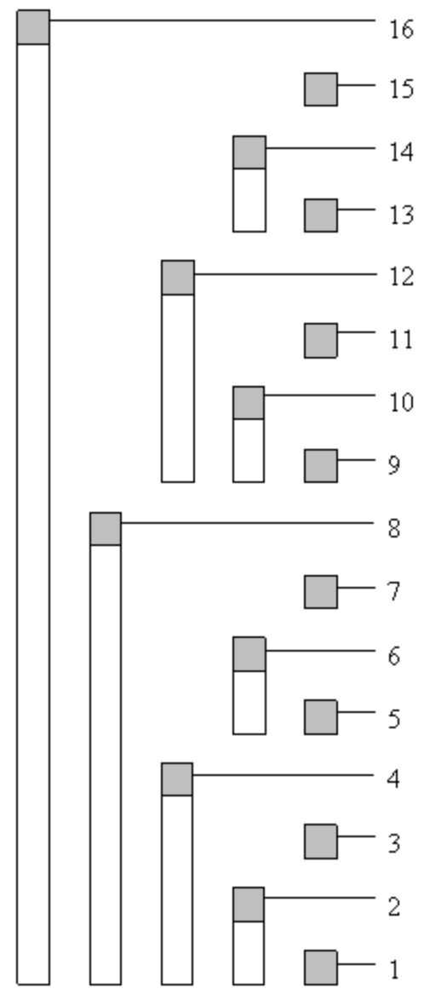

# Binary Indexed Tree(フェニック木)
2項演算(以降便宜上仮に"和"と呼ぶ)を与える．
区間クエリを求めたい配列の長さを\\(n\\)とすると，**Binary Indexed Tree(BIT)**の各操作と時間計算量は以下．
- 構築: \\(O(N \log N)\\)
- 値(モノイド)の更新: \\(O(\log N)\\)
- 配列の始めから任意のインデックスまでの累積"和": \\(O(\log N)\\)

## 説明
配列に単に値を持った場合，値の更新が\\(O(1)\\)でできる代わりに任意のインデックスまでの累積"和"を求めるのには\\(O(N)\\)かかる．逆に配列にそのインデックスまでの累積"和"を持つと，累積"和"の取得が\\(O(1)\\)でできる代わりに値の更新が\\(O(N)\\)かかってしまう．工夫すると，実はどちらのクエリにも高速(\\(O(\log N)\\))に答えることができる．

\\(O(\log N)\\)でこれらの操作をするために，偏りのない**2分木**を作り，親のノードにその部分木が持つ葉の"和"を持たせるというのが，**セグメント木**のアイディアであった．

BITでは，数のビット表現に注目する．BITの基本的なアイディアは，任意の**自然数がいくつかの2の累乗の和**であるのと同様に，**累積"和"はいくつかの「サブ累積"和"」の"和"**として表すことができるということである．例えばある数をビットで表した時に2つの位置のビットが立っているということは2つの累積"和"を含んでいるということ．

長さ\\(16\\)の配列にいくつか値を設置した例を見てみる．

| **Index** |1|2|3|4|5|6|7|8|9|10|11|12|13|14|15|16|
|:-:|:-:|:-:|:-:|:-:|:-:|:-:|:-:|:-:|:-:|:-:|:-:|:-:|:-:|:-:|:-:|:-:|
| **保持する区間** |1|1...2|3|1...4|5|5...6|7|1...8|9|9...10|11|9...12|13|13...14|15|1...16|
| **設置した値** |2|0|1|1|1|0|4|4|0|1|0|1|2|3|0|0|
| **実際の累積"和"** |2|2|3|4|5|5|9|13|13|14|14|15|17|20|20|20|
| **格納する値** |2|2|1|4|1|1|4|13|0|1|0|2|2|5|0|20|

実際に，BITで累積"和"を求めるにはどうするかというのを説明する．例えば閉区間\\([0, 13]\\)の累積"和"を求めてみる．まず\\(13\\)を2進数で表す．

$$13\_{(10)} = 1101\_{(2)}$$

このインデックスに格納された値を足しては最も右にある\\(1\\)を削除してそれを新しいインデックスとするという操作を，インデックス値が\\(0\\)になるまで繰り返す．

$$1101\_{(2)} → 1100\_{(2)} → 1000\_{(2)} → 0000\_{(2)}$$

この例ではインデックス\\(1101\_{(2)} = 13\_{(10)}\\)の値，インデックス\\(1100\_{(2)} = 12\_{(10)}\\)の値，インデックス\\(1000\_{(2)} = 8\_{(10)}\\)の値を足せばいいことになる．上の表で実際に足してみると，\\(2 + 2 + 13 = 17\\)となる．これは，閉区間\\([0, 13]\\)の実際の累積"和"の値と一致している．また，\\(13, 12, 8\\)が保持する区間を見てみると，\\(1...8, 9...12, 13\\)となっていることからも正しい「サブ累積"和"」を足せていることがわかる．

表だとわかりにくいが，これを木構造として見てみるとわかりやすい．

<div align="center"></div>

このようにして，ビットが\\(1\\)になっているところの個数回の演算で，指定されたインデックスまでの累積"和"を求めることが可能であるため，累積"和"を求めるクエリの計算量は，ビット長から，明らかに\\(O(\log N)\\)である．

最後に値の更新だが，あるインデックスを，自身が保持する区間に含めるインデックスの個数も，ビット長から，明らかに\\(O(\log N)\\)しかないため，これらのインデックスのみを更新する計算量も，\\(O(\log N)\\)である．

## 任意区間の累積"和"を求めたい場合
BITで任意区間の累積"和"が求められるケースは限られている．例えば，整数での和を扱っている場合，閉区間\\([a, b]\\)の累積和(これは文字通り和)は\\([0, b]\\)の値から\\([0, a-1]\\)の値を引くことで求められる．このように，扱っている**代数系**に，**逆元**が定義できる場合，つまり，扱っている代数系が**群**である場合は，BITで任意区間の累積"和"が求めることができる．

## 実装
説明はややこしく見えるが，コード上では，ビット演算によりアクセスすべきインデックスを簡単に計算できるため，実装は軽い．例えば，ある数\\(x\\)を2進数表した時に最も右にある\\(1\\)だけを取り出すには，\\(x＆(-x)\\)とするだけである．

## Fenwickさんの論文
P.Fenwick, A new data structure for cumulative frequency tables, Software Practice and Experience Vol 24, 1994

## コード
[](https://judge.yosupo.jp/submission/77587)

```cpp
template <typename T>
struct BinaryIndexedTree {
  int n;
  vector<T> data;

  BinaryIndexedTree(int size) {
    n = ++size;
    data.assign(n, 0);
  }

  // get sum of [0,k]
  T sum(int k) const {
    if (k < 0) return 0;
    T ret = 0;
    for (++k; k > 0; k -= k&(-k)) ret += data[k];
    return ret;
  }

  // getsum of [l,r]
  inline T sum(int l, int r) const { return sum(r) - sum(l-1); }

  // data[k] += x
  void add(int k, T x) {
    for (++k; k < n; k += k&(-k)) data[k] += x;
  }
```