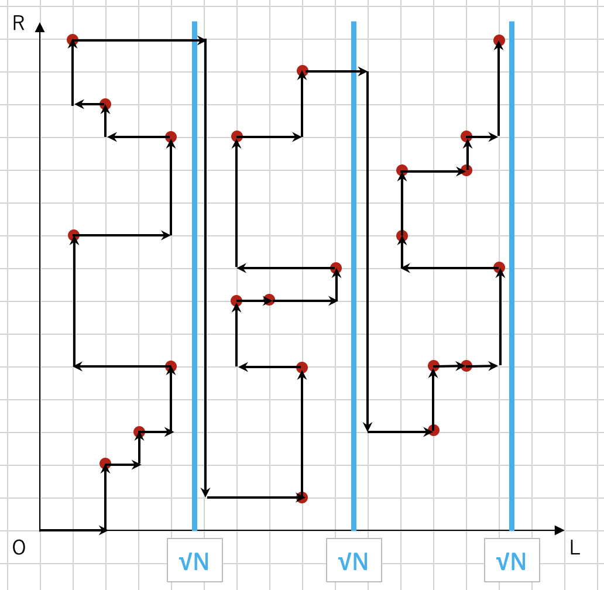

# Mo's algorithm
**Mo's algorithm**とは，長さ\\(N\\)配列に対して，\\(Q\\)個の区間クエリを合計で\\(O((N + Q)\sqrt{N})\\)で処理するアルゴリズムである．Mo's algorithmを適用するには，以下の条件を満たしている必要がある．

- 処理する全クエリを先読みできる(オフラインクエリ)．
- 配列の各要素が不変．
- 区間\\([l, r)\\)の結果から区間\\([l+1, r)\\)，\\([l−1, r)\\)，\\([l, r−1)\\)，\\([l, r+1)\\)の結果をある程度高速に計算できる．(最終的な計算量に影響する．)
- 区間\\([l, m)\\)と区間\\([m, r)\\)をマージして\\([l, r)\\)を高速に計算することができない．(これができるなら**セグメント木**などを使えば良い．)

要するに，少し複雑な区間クエリに高速に対応するためのアルゴリズムである．

## 説明
**オフラインクエリ**というのは，クエリを，実際に，与えられた順番で処理する必要がないことを意味する．また，上で述べた条件で，\\([l, r)\\)に対する区間クエリを求めた後に，\\([l+1, r)\\)，\\([l−1, r)\\)，\\([l, r−1)\\)，\\([l, r+1)\\)のクエリを高速に求められるというのがあった．これは，区間を左/右に1つ伸び縮みした区間のクエリを高速に求められることを意味する．

Mo's algorithmの基本的なアイディアは，クエリを適切に並び替え，全体での**区間の伸び縮みの回数を最小限に抑え**られば，全体での計算量を抑えられるということである．

ある区間\\([l\_1, r\_1)\\)を求めてからある区間\\([l\_2, r\_2)\\)までに行われる伸び縮みの回数は，\\(|l\_1 - l\_2| + |r\_1 - r\_2|\\)である．このことから，\\((l\_i, r\_i)\\)を座標としてみることで，**任意の2つの区間の間の伸び縮み回数は，2次元座標上でのマンハッタン距離**を意味することがわかる．

よって，**2次元座標上に設置された全ての点を1回ずつ通る道の中で総移動距離が最短のもの**を見つけ出したいのだが，これは巡回セールスマン問題とほぼ同じ問題であるため，**NP困難**な問題である．そこで，全体の計算量がある程度小さくなるように全\\((l\_i, r\_i)\\)を通る方法として，この図のような通り方を考える．

<div align="center"></div>

**クエリを\\(l\_i\\)について\\(\sqrt{N}\\)ごとにブロックにわけ，ブロックの昇順に，ブロックごとに\\(r\_i\\)の昇順に点を辿る**．

このように辿ることで，ブロックごとに\\(r\\)の移動は\\(O(N)\\)でブロック数は\\(\sqrt{N}\\)なので，全部で\\(r\\)の移動は\\(O(N\sqrt{N})\\)，また，\\(l\\)の移動は\\(O(\sqrt{N})\\)の移動を\\(Q\\)回繰り返すので，全部で\\(l\\)の移動は\\(O(Q\sqrt{N})\\)になる．よって，**全体の計算量は\\(O((N + Q)\sqrt{N} \times\\)区間を\\(1\\)伸び縮みさせる計算量\\()\\)である**．

このように，クエリについて\\(\sqrt{N}\\)や\\(\sqrt{Q}\\)に分割して処理することで全体の計算量を抑える手法は一般に**平方分割**と呼ばれる．

## 高速化
Mo's algorithmは，クエリを，上で述べたようにソートするフェーズと，実際に座標を移動しながらクエリを処理するフェーズの2つのフェーズから成る．このうち1つ目のクエリをソートするフェーズについて，ソート方法を工夫することで高速化する方法がいくつかある．

最も有名なのは**Hilbert曲線**に沿って原点から2次元空間を移動する順番(**Hilbert Order**と呼ばれる)にクエリを処理する方法である．

<div align="center"><br><a href="https://en.wikipedia.org/wiki/Hilbert_curve">https://en.wikipedia.org/wiki/Hilbert_curve</a></div>

Hilbert曲線は，**局所性が高く**，**Hilbert曲線において原点からの距離が近い(Hilbert Orderが近い)ことから，その空間での距離も近いことがわかる**．よって，**Hilbert Orderでクエリをソート**し，その順にクエリを処理することで上で述べた方法よりも全体でかかる計算量が小さくなる．

## コード

このコードでは，Hilbert Orderによるソートを用いている．コード中の`maxn`の値は，\\(N\\)以上の最小の\\(2\\)の累乗値にする必要がある．

[](https://judge.yosupo.jp/submission/77813)

```cpp
constexpr int maxn = 1 << ??;
i64 hilbertorder(int x, int y) {
  i64 rx, ry, d = 0;
  for (i64 s=maxn>>1; s; s>>=1) {
    rx = (x & s)>0, ry = (y & s)>0;
    d += s * s * ((rx * 3) ^ ry);
    if (ry) continue;
    if (rx) {
      x = maxn-1 - x;
      y = maxn-1 - y;
    }
    swap(x, y);
  }
  return d;
}

struct Mo {
private:
  int q = 0;
  vector<int> l, r;
public:
  void insert(int l_, int r_) {
    q++;
    l.emplace_back(l_);
    r.emplace_back(r_);
  }

  // F1~F5: lambda関数
  template<typename F1, typename F2, typename F3, typename F4, typename F5>
  void execute(F1 &&add_l, F2 &&add_r, F3 &&del_l, F4 &&del_r, F5 &&solve) {
    vector<int> qi(q);
    iota(all(qi), 0);
    vector<i64> eval(q);
    rep (q) eval[i] = hilbertorder(l[i], r[i]);
    sort(all(qi), [&](int i, int j) {
      return eval[i] < eval[j];
    });
    int nl = 0, nr = 0;
    for (int i: qi) {
      while (nl > l[i]) add_l(--nl);
      while (nr < r[i]) add_r(nr++);
      while (nl < l[i]) del_l(nl++);
      while (nr > r[i]) del_r(--nr);
      solve(i);
    }
  }
};
```
