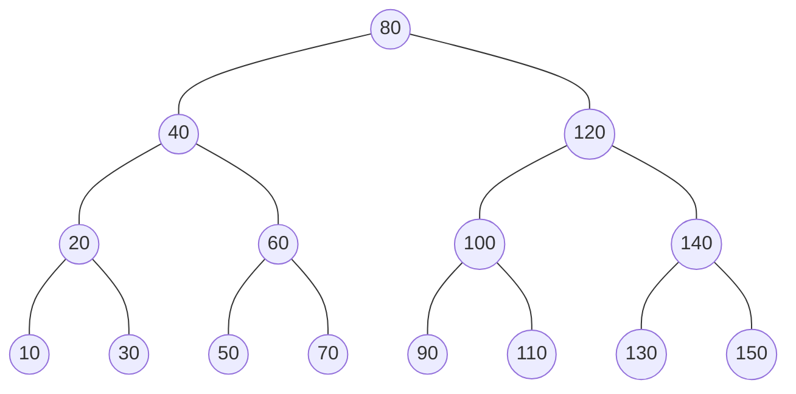
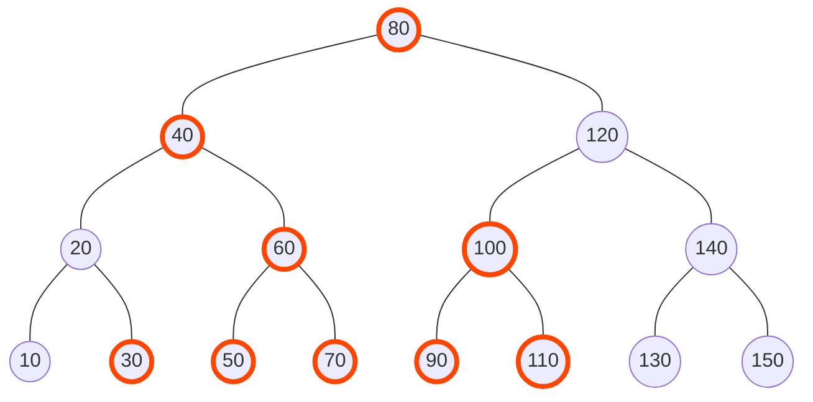
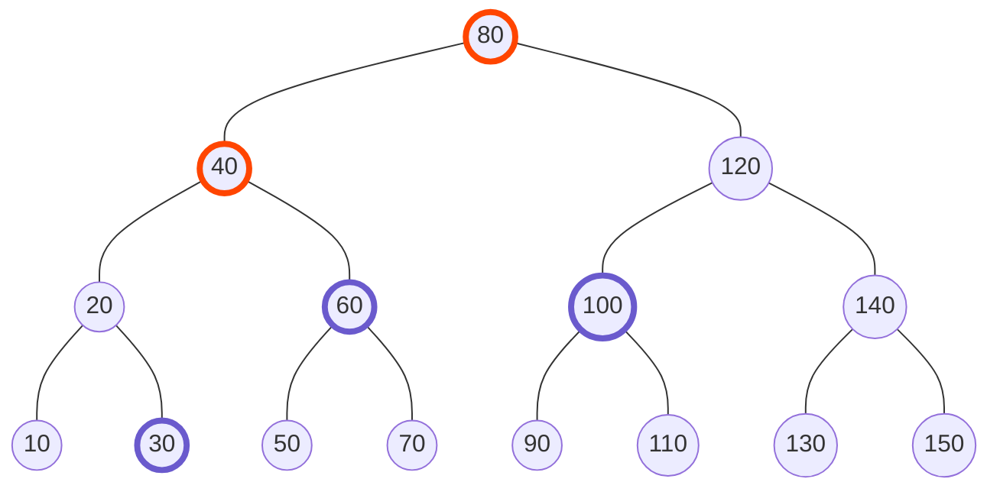
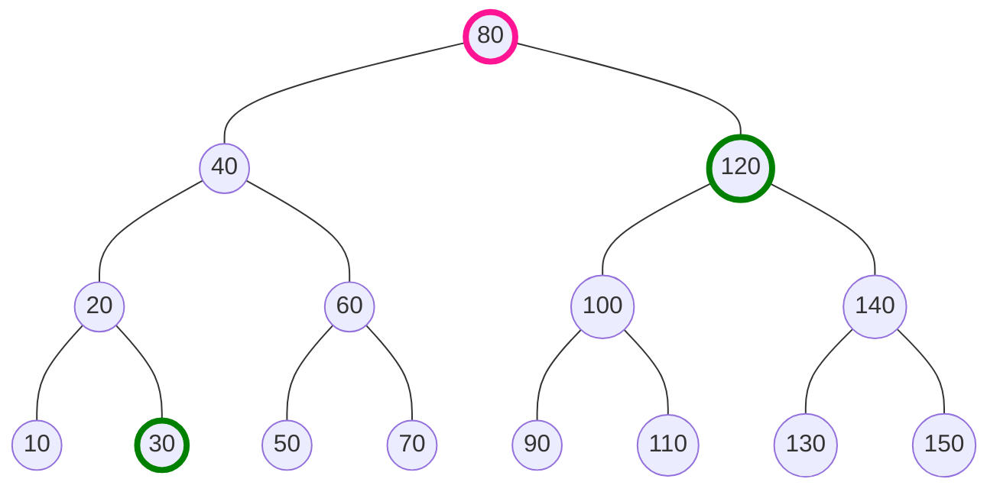
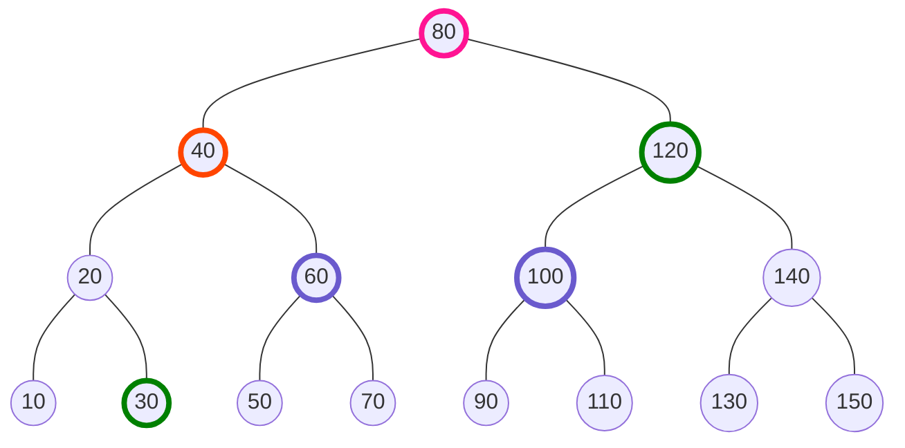

# RangeBST
2項演算(以降便宜上仮に"和"と呼ぶ)を与える．
扱う座標数を\\(N\\)とすると，**RangeBST**の各操作と時間計算量は以下．
- 構築: 処理なし
- 指定された1次元座標に値(モノイド)の設置: \\(O(\log N)\\)
- 指定された1次元座標の値の更新: \\(O(\log N)\\)
- 任意の座標区間の"和" : \\(O(\log N)\\)

※このRangeBSTという名前は，筆者が勝手につけたもので，このデータ構造には特別名前はなく，中身はBST，つまり**平衡2分探索木**である．平衡2分探索木に機能を追加することで能力を拡張する例は多々あり，これはその1つの例である．

**セグメント木と同じ?と思った方もいるかもしれないが，実は少し違う**．セグメント木は，配列に対する区間クエリに対応したもの，つまり，言い換えると**座標に制限(0~配列のサイズ)がある**．RangeBSTは，データを，**座標の集合**としてもつため，座標の値自体に制限がなく，座圧+セグ木で解く必要がある問題も，RangeBSTなら座圧せずに解くことができる(**データ構造内部でも座圧操作をしない！！**)ため，実装が楽になり，実行速度も速くなることがある．

## 説明
配列に対する区間クエリではないため，最初にサイズを与えたりはしない．使用するメモリ量は，追加した座標の数に比例して動的に増える(座標に重複がある場合は増えない)．

例えば，座標10, 20, 30, 40, 50, 60, 70, 80, 90, 100, 110, 120, 130, 140, 150にそれぞれ何かしらの値を設置したとする．このとき，平衡2分探索木でこの集合を持つ形は複数あるが，仮に1番綺麗な形として下のようになったとしよう．



ではここで，座標\\(25 \sim 115\\)の累積"和"を求めよと言われたら，どこのノードの値の"和"を求めればいいかというと，下の赤い部分である．



もちろんそのままやっていてはノード数分の計算量がかかるが，上の赤く塗られたノードを見ると，平衡2分探索木のおかげである程度まとまった位置に求めたいノードが集まっていることがわかる．

じゃあ**それぞれのノードが自分を根とする部分木の"和"を持っていたら**どうなるかと考えると，見るノードは下の色がついたノードだけでよくなることがわかる．赤いノードはそのノードの値が必要であることを示しており，青いノードはそのノードを根とする部分木の累積"和"が必要であることを示している．



とても少なくなった．実は，この工夫だけで，任意区間の累積"和"を求めるのに必要なノード数が\\(O(\log N)\\)個に抑えられるのである．その理由を説明する．

これは言葉で説明するより図と疑似コードを見た方がわかりやすい．

よりちゃんとした書き方として，累積"和"を取得したい区間を \\([25, 115)\\)と書く．\\([\\)は閉区間を意味し，\\()\\)は開区間を意味する．まず，\\(25\\)と\\(115\\)を木上で2分探索(`lower_bound`)すると，下の緑のノードにたどり着く．また，この2つのノードのLCAをピンク色で示す．



左のノードは，LCAまで上りながら，**右の部分木**がある場合だけその累積"和"を累積すればよく，右のノードも同様に，LCAにまで上りながら，**左の部分木**がある場合だけその累積"和"を累積すればよい．わかりづらいと思うので，先ほどの図と重ねてみるとわかりやすい．
　


疑似コードを示すとこのようになる．

```rs
fn prod(xl: i64, xr: i64) -> S {
  let l: *Node = lower_bound(xl);
  let r: *Node = lower_bound(xr);
  let lca: *Node = get_lca(l, r);
  let lprod: S = e();
  { // 左からLCAまで上りながら右側の部分木を累積
    for (bool f = true; l != lca;) {
      if (f) lprod = op(lprod, l.r.prod_subtree);
      f = l.is_left_child();
      if (f && l.p != lca) lprod = op(lprod, l.p.v);
      l = l->p;
    }
  }
  let rprod: S = e();
  { // 右からLCAまで上りながら左側の部分木を累積
    for (bool f = true; r != lca;) {
      if (f) rprod = op(r.l.prod_subtree, rprod);
      f = r.is_right_child();
      if (f && r.p != lca) rprod = op(r.p.v, rprod);
      r = r->p;
    }
  }
  return op(op(lprod, lca.v), rprod);
}
```

よって，区間クエリの処理は，まず木上で`lower_bound`し，その次に2つのノードからLCAまで上りながら\\(O(1)\\)の演算を各ステップで行うだけである．したがって，平衡2分探索木の高さが\\(\log N\\)であることから，計算量は\\(O(\log N)\\)となる．

最後に，更新クエリや挿入クエリについて説明する．挿入/更新を\\(O(\log N)\\)で行えることは平衡2分探索木の章を確認して欲しい．挿入/更新後，ノードの累積"和"の値に影響が出るのは該当ノードの祖先ノード高々\\(O(\log N)\\)個であるため，それらの値を更新していけばよい．計算量は\\(O(\log N) + O(\log N) = O(\log N)\\)となる．

## 実装におけるその他の注意事項
モノイドを扱っているため，例のごとく演算の向きを間違えないようにする．

以上！

## コード
平衡2分探索木にSplay木を用いた実装．

[](https://judge.yosupo.jp/submission/75623)

```cpp
template <class S, S (*op)(S, S), S (*e)()> struct Node {
  Node<S, op, e> *l, *r, *p;
  i64 pt;
  S v, prod_st;
  explicit Node(i64 pt_, S v_)
    : l(nullptr), r(nullptr), p(nullptr), pt(pt_), v(v_), prod_st(v_) {}
  int state() {
    if (p && p->l == this) return -1;
    if (p && p->r == this) return 1;
    return 0;
  }
  S get_lprod() {
    if (!l) return e();
    return l->prod_st;
  }
  S get_rprod() {
    if (!r) return e();
    return r->prod_st;
  }
  void update() {
    prod_st = op(op(get_lprod(), v), get_rprod());
  }
  void rotate() {
    Node<S, op, e> *par = p;
    Node<S, op, e> *mid;
    if (p->l == this) {
      mid = r; r = par;
      par->l = mid;
    } else {
      mid = l; l = par;
      par->r = mid;
    }
    if (mid) mid->p = par;
    p = par->p; par->p = this;
    if (p && p->l == par) p->l = this;
    if (p && p->r == par) p->r = this;
    par->update(); update();
  }
  void splay() {
    while(state()) {
      int st = state() * p->state();
      if (st == 0) {
        rotate();
      } else if (st == 1) {
        p->rotate();
        rotate();
      } else {
        rotate();
        rotate();
      }
    }
  }
};

template <class S, S (*op)(S, S), S (*e)()> struct RangeBST {
private:
  using NC = Node<S, op, e>;
  NC *root, *min_, *max_;
  void splay(NC *node) { node->splay(), root = node; }
  NC* bound(i64 x, bool lower) {
    NC *valid = nullptr, *left = root, *right = nullptr;
    while (left) {
      valid = left;
      if ((lower && !(x > left->pt)) || (!lower && (x < left->pt))) {
        right = left;
        left = left->l;
      } else left = left->r;
    }
    if (!right && valid) splay(valid);
    return right;
  }
  void set(i64 x, S val, bool add) {
    NC *nn = new NC(x, val);
    // if no nodes in tree
    if (!root) {
      min_ = nn, max_ = nn, root = nn; return;
    } if (min_->pt > x) { // if x become min key in tree
      min_->l = nn, nn->p = min_, min_ = nn;
      splay(nn); return;
    } if (max_->pt < x) { // if x become max key in tree
      max_->r = nn, nn->p = max_, max_ = nn;
      splay(nn); return;
    }
    NC *node = bound(x, true); // assert node is not null
    if (node->pt == x) { // if tree already has key x
      if (add) node->v = op(node->v, val);
      else node->v = val;
      node->update(); splay(node); delete nn; return;
    }
    // now node is first node whose key is larger than x
    nn->l = node->l; node->l = nn;
    nn->p = node; if (nn->l) nn->l->p = nn;
    nn->update(); splay(nn);
  }
public:
  RangeBST() : root(nullptr), min_(nullptr), max_(nullptr) {}
  NC* lower_bound(i64 x) {
    NC *ret = bound(x, true);
    if (ret) splay(ret);
    return ret;
  }
  NC* upper_bound(i64 x) {
    NC *ret = bound(x, false);
    if (ret) splay(ret);
    return ret;
  }
  S get(i64 x) {
    NC *ret = lower_bound(x);
    if (!ret || ret->pt != x) return e();
    return ret->v;
  }
  void set(i64 x, S val) { set(x, val, false); }
  void add(i64 x, S val) { set(x, val, true); }
  S prod(i64 xl, i64 xr) {
    assert(xl <= xr);
    if (!root || xl > max_->pt || xr <= min_->pt) return e();
    if (xl <= min_->pt && xr > max_->pt) return root->prod_st;
    if (xl <= min_->pt) return lower_bound(xr)->get_lprod();
    lower_bound(xl); // now xl is root
    if (xr > max_->pt) return op(root->v, root->get_rprod());
    NC *right = bound(xr, true);
    NC *tmp = right;
    S ret = e();
    for (bool f = true; tmp != root;) {
      if (f) ret = op(tmp->get_lprod(), ret);
      f = tmp->state() == 1;
      if (f) ret = op(tmp->p->v, ret);
      tmp = tmp->p;
    }
    if (right) splay(right);
    return ret;
  }
};
```