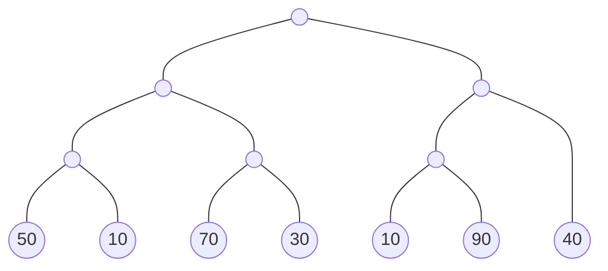
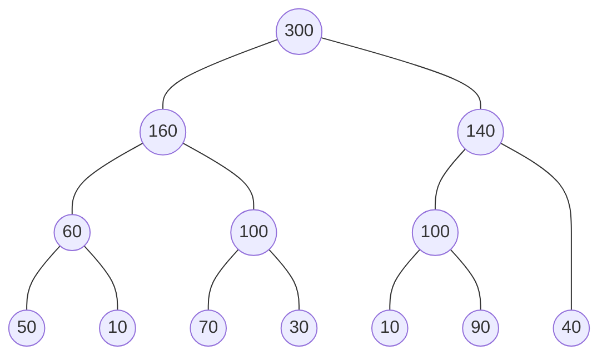
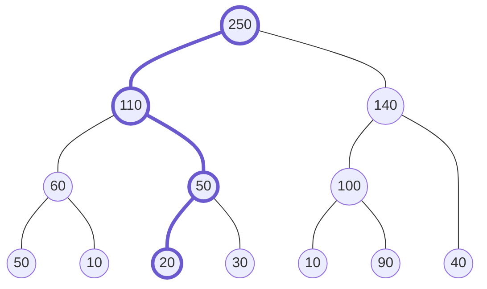
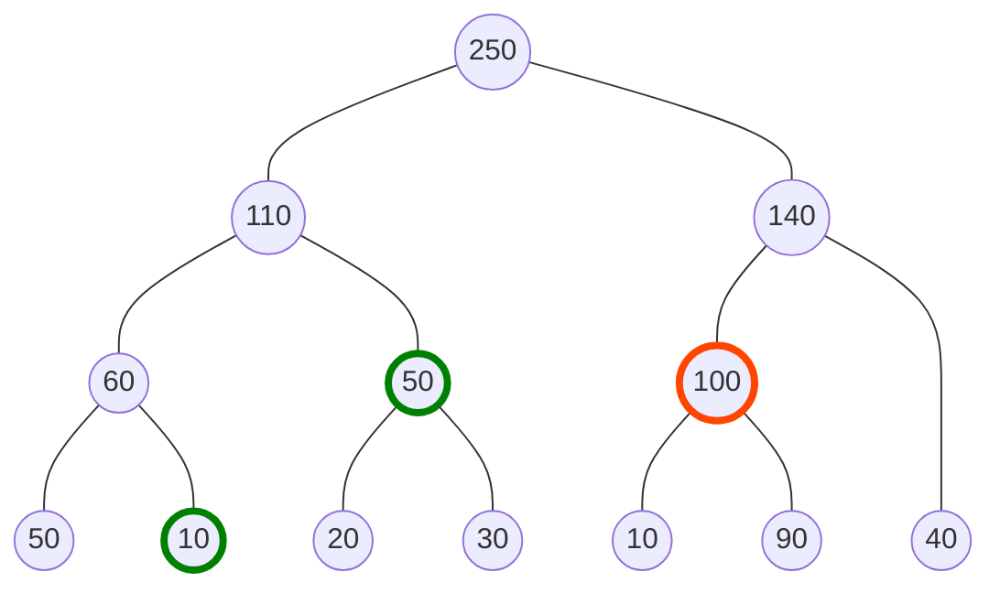
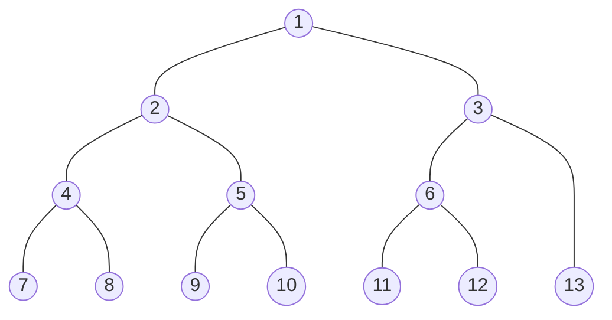
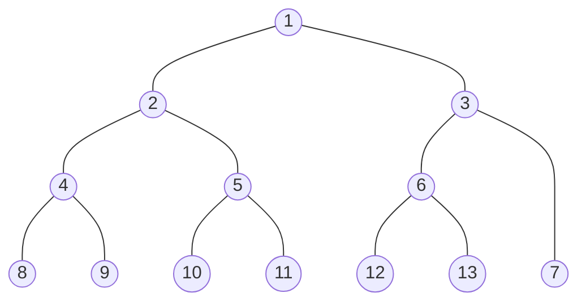
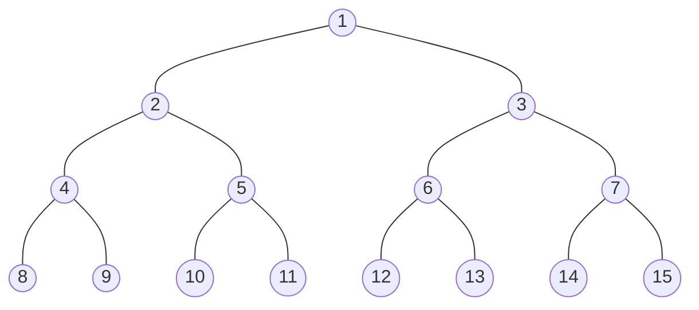

# セグメント木
区間クエリを求めたい配列の長さを\\(N\\)とすると，**セグメント木**の各操作と時間計算量は以下．
- 構築: \\(O(N)\\)
- 値(モノイドを成す集合の要素)の更新: \\(O(\log N)\\)
- 配列の任意の区間の"和"(モノイドにおける2項演算): \\(O(\log N)\\)

## 説明
配列の区間の累積"和"を木で管理することで，区間クエリ，更新クエリを高速に計算する．

配列の初期値を

|50|10|70|30|10|90|40|

として，配列の要素を葉とする2分木を構築すると，このようになる．

ノードを集約する上のノードに，子の"和"を持たせるとこのようになる．

先に更新クエリを考える．例えば配列の左から3番目の値70を20に更新するとこのようになる．

更新する場所を青く示している．どの場所を更新しても，木の高さ個のノードしか変化せず，かつ，この木は**偏りのない2分木**であるため，更新クエリは\\(O(\log N)\\)である．

次に区間クエリを考える．これは，左側の累積"和"と右側の累積"和"に分けて考えるとわかりやすい．

例として配列の2番目から6番目までの累積"和"を求める．

緑が左側の累積"和"で使う値，赤が右側の累積"和"で使う値を示している．**どのような区間クエリであってっも，左側と右側それぞれには，同じ深さのノードは1度しか現れない**．なぜなら，同じ深さのノード2つは上のノード1つで集約できるはずだからである．

よって，区間クエリの計算量も\\(O(\log N)\\)である．

## 実装
区間クエリを求めたい配列の要素数が変化しないと仮定すると，**セグメント木の構造は静的であり変化しない**ことがわかる．これを利用して，セグ木の実装ではノードを単に\\(2*N-1\\)この配列で管理することができる．

ノードを管理する配列上でのそのノードのインデックスを示すと，このようになる．

しかし，これではこのように構築すると，親<->子間のインデックスに規則性がなく，非常に扱いづらくなる．

そこで，以下のような工夫が考えられる．

先ほどと比較して何が嬉しいかというと，この木では，**親のインデックスを\\(i\\)とすると子のインデックスは必ず\\(\lbrace 2 \times i, 2 \times i+1 \rbrace\\)になっており，さらに，子のインデックスを\\(i\\)とすると，その親のインデックスは必ず\\(i/2\\)になっている**．

そのため，このように構築することで親<->子間の移動が非常に楽になり，実装が短くなる．

しかし，気づいている方もいるかもしれないが，この実装だと，**親の累積"和"において子の順序が保たれていないため，任意のモノイドをのせることはできない**．

しかし，モノイドではなく，和や積，min，maxというような可換性を有する2項演算はのせることができるため，その場合は問題ない．例えば，後の章で扱うが，**2次元区間クエリを扱うような場合，可換性を有さないモノイドをのせることはあまりないと考えられるため，ノード数を少なく抑えられるこの実装は有用である**．

では，任意のモノイドをのせるためにはどうすればいいかというと，下のように構築すると良い．

先ほどよりノード数が多くなっている．これは，**要素数を超える最小の2の冪乗の値を要素数にする**という実装である．余分に枠を取ることで，**子の順序を保ったまま**親に累積"和"を持たせることができる．また，先ほどと同様に親<->子間の移動も楽である．

**ノード数は最大でも\\(2\\)倍程度しか増えない**ため，空間計算量も時間計算量も変化しない．

## コード
[atcoder/segtree.hpp](https://github.com/atcoder/ac-library/blob/master/atcoder/segtree.hpp)
